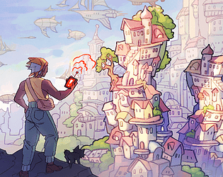

# Urban-Outcasts (2nd Semester Project Stundent Project)

Homepage: https://s4g.itch.io/tanukis-dream

#### 2.5D isometric Adventure/rpg game made in Unity

The player’s goal is to explore the setting of the story through a variety of characters by talking and completing quests. The world is filled with diverse characters from different worlds, cultures and creature races.

#### Roles
- Gameplay Programmer

#### Engine / Language
- Unity, C#

#### Systems
- [C# Scripts](./Assets/MainGame/Scripts)
- [Player](./Assets/MainGame/Scripts/Player)
- [Dialogue System](./Assets/MainGame/Scripts/Dialogues)
- [Interaction System](./Assets/MainGame/Scripts/Interactables)
- [Save System](./Assets/MainGame/Scripts/DataPersistence)
